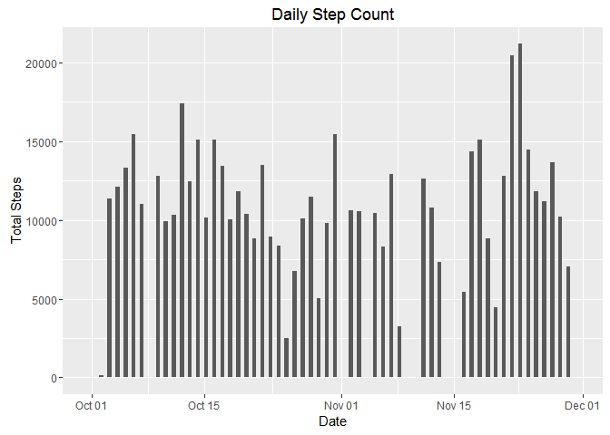
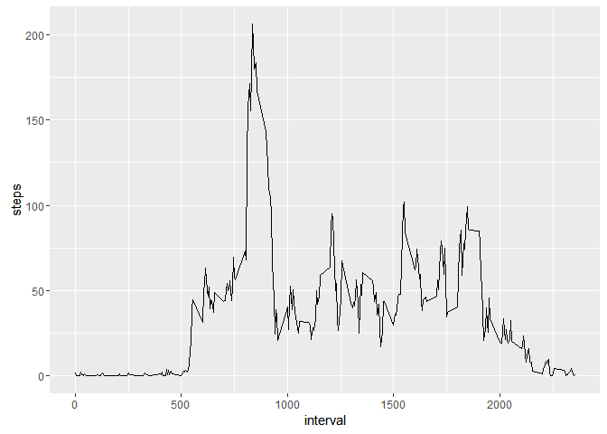
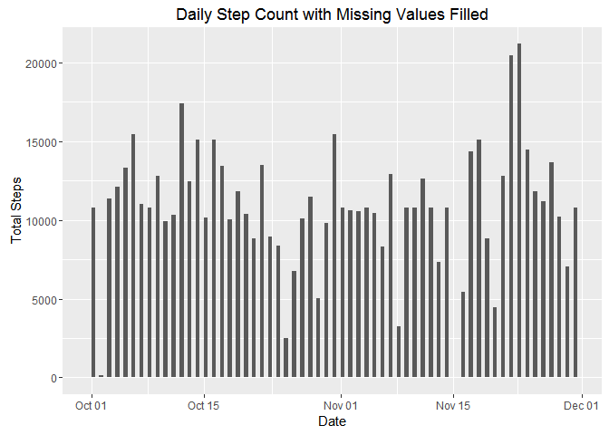
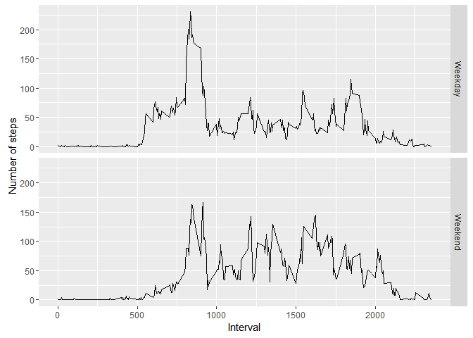

# Reproducible Research: Peer Assessment 1


## Loading and preprocessing the data

```r
library(dplyr)
```

```
## Warning: package 'dplyr' was built under R version 3.2.3
```

```r
library(ggplot2)
```

```
## Warning: package 'ggplot2' was built under R version 3.2.3
```


```r
if(!file.exists("./activity.csv"))
   {
      unzip("./activity.zip")
  }
activities <- read.csv(file = "./activity.csv")  #Read in the data
activities$date <- as.Date(activities$date)  ## Assign datatype date
```


## What is mean total number of steps taken per day?

Histogram of the total number of steps taken each day

```r
## Creats Histogram of Steps by Date
a <- ggplot(activities,aes(date))+ geom_histogram(bins = 62, aes(weight = steps), binwidth = .5)+ylab("Total Steps") + xlab("Date")+ggtitle("Daily Step Count")
```





Mean and median number of steps taken each day

```r
activities2 <- group_by(activities,date)
totalDailySteps <- summarise_each(activities2, funs(sum(.,na.rm = TRUE)), -interval)

## Mean of Total Steps Taken Each Day
meanDailySteps <- mean(totalDailySteps$steps, na.rm = TRUE)

##Median of Total Steps Taken Each Day
medianDailySteps <- median(totalDailySteps$steps, na.rm = TRUE)
```
Mean number of steps taken each day


```
## [1] 9354.23
```

Median number of steps taken each day

```
## [1] 10395
```


## What is the average daily activity pattern?

Time series plot of the average number of steps taken

```r
activities3 <- group_by(activities,interval)
activities_interval_means <- summarise_each(activities3, funs(mean(.,na.rm = TRUE)), -date)

g <- ggplot(activities_interval_means, aes(interval, steps)) + geom_line()
```





The 5-minute interval that, on average, contains the maximum number of steps

```r
minutes <- group_by(activities,interval)
average_steps_by_minute <-summarise_each(minutes, funs(mean(.,na.rm=TRUE)),-date)
max_steps <- max(average_steps_by_minute$steps)
max_steps_interval <-  filter(average_steps_by_minute, steps == max_steps)$interval
```

Interval with the Most Steps


```r
max_steps_interval
```

```
## [1] 835
```


## Imputing missing values


```r
## Total Number of Missing Calculations
missingValueCount <- subset(activities,is.na(steps))
numMissingValues <- nrow(missingValueCount)


##Strategy for filling in all of the missing values in the dataset: 
## Create a new dataset activitiesFilled, which will have all missing filled in
## If step value is NA, then use the mean number of steps taken for the interval across all dates.
## Since steps can only be integers, number of steps will be rounded to 0 digits.

activitiesFilled <- activities

for(i in 1:nrow(activitiesFilled)){
  if (is.na(activitiesFilled$steps[i])) 
    activitiesFilled$steps[i] <- round(activities_interval_means$steps[activities_interval_means$interval == activitiesFilled$interval[i]], digits = 0)
}

## Creats Histogram of Steps by Date
f <- ggplot(activitiesFilled,aes(date))+ geom_histogram(bins = 62, aes(weight = steps), binwidth = .5)+ylab("Total Steps") + xlab("Date")+ggtitle("Daily Step Count with Missing Values Filled")
```


Mean and Median Total Number of Steps Taken Each Day


```r
activitiesFilled2 <- group_by(activitiesFilled,date)
totalDailyStepsFilled <- summarise_each(activitiesFilled2, funs(sum(.,na.rm = TRUE)), -interval)


## Mean of Total Steps Taken Each Day
meanDailyStepsFilled <- mean(totalDailyStepsFilled$steps, na.rm = TRUE)


##Median of Total Steps Taken Each Day
medianDailyStepsFilled <- median(totalDailyStepsFilled$steps, na.rm = TRUE)
```

Mean number of steps taken each day
Note: The mean number of steps taken each day with the missing values filled in is larger than the original dataset.


```
## [1] 10765.64
```

Median number of steps taken each day
Note: The mediaan number of steps taken each day with the missing values filled in is larger than the original dataset.


```
## [1] 10762
```


## Are there differences in activity patterns between weekdays and weekends?


```r
activitiesFilledDayOfWeek <- activitiesFilled

weekday <- c("Monday","Tuesday","Wednesday","Thursday","Friday")
activitiesFilledDayOfWeek$DayOfWeekCat <- ifelse(weekdays(activitiesFilledDayOfWeek$date) %in% weekday,"Weekday","Weekend")
activitiesFilledDayOfWeek$DayOfWeekCat <- as.factor(activitiesFilledDayOfWeek$DayOfWeekCat)

minutesFilled <- group_by(activitiesFilledDayOfWeek,interval,DayOfWeekCat)
average_steps_by_minuteFilled <-summarise_each(minutesFilled, funs(mean(.,na.rm=TRUE)),-date)
```

Plot shows that the number of steps is more evenly distributed across intervals for weekends.


